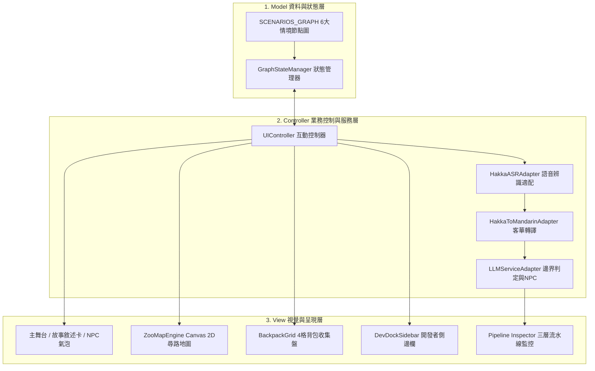

# 📋 連鎖情境任務原型系統 (Chain Quest) — 6 大情境任務說明與 MVC 架構規格表

> **💡 系統架構簡介：**
> 本原型系統採用清晰的 **MVC (Model-View-Controller)** 模組化設計，支援「**客語專用模式 (客委會 ASR)**」與「**華語對照模式 (瀏覽器內建)**」雙軌切換，以及「**口說分支選擇**」、「**Canvas 2D 地圖尋路**」、「**4 格背包自由收集**」與「**LLM-as-a-Judge 邊界判定**」。

---

## 🏗️ MVC 架構設計說明 (Architecture Overview)

### 1. Model (資料與狀態層)
- **`SCENARIOS_GRAPH`**：
  - 定義 6 大生活情境的節點圖（包含主線、分支選擇、地圖尋路、背包收集、出口集合等節點類型）。
  - 每個節點完整封裝：**雙語題目引導語** (`storyPrompt` / `mandarinStoryPrompt`)、**雙語標準答案** (`targetHakka` / `targetMandarin`)、**雙語關鍵詞** (`keywords` / `mandarinKeywords`)、**NPC 人設與頭像**，以及**通關與重試動態回應**。
- **`GraphStateManager`**：
  - 管理遊戲運行狀態：當前情境 ID、當前節點 ID、分支路線選擇 (`selectedChoiceId`, `selectedTargetBranchId`, `targetZoneCode`)、背包收集清單 (`collectedItems`)、已通關節點 (`completedNodes`)、口說語言模式 (`speechMode`: `hakka` | `mandarin`)。

### 2. View (視覺呈現層)
- **主舞台與故事敘述卡 (`narrativeCard`)**：顯示情境插畫、關卡標籤、故事題目、學生對話氣泡與 NPC 回應對話。
- **2D Canvas 動物園地圖尋路 (`ZooMapEngine`)**：以綠衣小人平滑移動、步道碰撞偵測、展區以 `❓` 問號呈現，驗證學生是否依據口說指引正確走位。
- **4 格背包收集盤 (`backpackPanel`)**：非線性自由點選物品，練習每樣物品的名稱與用途。
- **開發者側邊欄 (`devDockSidebar`)**：提供快速跳關、自訂文字測試、分支免口說切換、目標句與關鍵詞對照、Live JSON 結構預覽。
- **流水線即時監控 (`Pipeline Inspector`)**：即時展示 `1. ASR 語音轉文字` ➔ `2. MT 客華轉譯` ➔ `3. LLM 語意邊界評審` 三層運算狀態。

### 3. Controller (業務控制與服務層)
- **`UIController`**：協調整體生命週期、按鈕事件監聽、語言模式切換、點擊錄音開關與畫面重繪。
- **`HakkaASRAdapter`**：ASR 語音辨識適配器（客語連線客委會 WebSocket 即時 ASR；華語使用 Web Speech API）。
- **`HakkaToMandarinAdapter`**：客轉華正規化翻譯適配器（支援外部 API 與本機 60+ 生活情境對照字典）。
- **`LLMServiceAdapter`**：語意邊界評審考官（呼叫 Google Gemini 後端 `/api/judge`，支援精準對錯判定、動態 NPC 角色扮演台詞，以及 429 頻率冷卻情境緩衝）。

---

## 📑 6 大情境任務說明與關卡詳細規格 (Scenarios Spec)

### 🦁 情境一：動物園連鎖任務 (`zoo_chain`)
- **情境目標**：體驗購票、驗票、口說問路並依照指引在 Canvas 地圖操縱角色走入展區，完成對話並於出口集合。
- **MVC 節點流轉**：`zoo_start` (主線) ➔ `zoo_gate` (主線) ➔ `zoo_choose_animal` (口說分支選擇) ➔ `zoo_map_nav` (Canvas 地圖尋路) ➔ 展區互動 (`zoo_elephant` / `zoo_lion` / `zoo_snake`) ➔ `zoo_meet_point` (集合點)。

| 關卡 ID | 關卡標題與地點 | 關卡類型 | 題目引導語 (華語/客語) | 目標客語句 (客語模式) | 目標華語句 (華語模式) | 客語關鍵詞 | 華語關鍵詞 | NPC 角色 |
| :--- | :--- | :---: | :--- | :--- | :--- | :--- | :--- | :---: |
| `zoo_start` | 第一關：購票入園 `動物園大門售票處` | 主線 | 輪到你上前時，準備跟售票員買三張學生票。你說： | **𠊎愛買三張學生票。** | 我要買三張學生票。 | `三張`、`愛買`、`學生票` | `我要買`、`三張`、`學生票` | 售票員 🧑‍💼 |
| `zoo_gate` | 第二關：驗票進場 `入園驗票閘門` | 主線 | 走到閘門前，志工奶奶準備驗票，向她道謝。你說： | **這係𠊎个門票，恁仔細。** | 這是我的門票，謝謝。 | `門票`、`恁仔細` | `這是`、`門票`、`謝謝` | 驗票志工 👵 |
| `zoo_choose_animal` | 第三關：問路找展區 `園區路口導覽站` | 選擇 | 開口向導覽員詢問你想去的展區（大象/獅子/蛇）： | **請問大象區愛仰般行？** | 請問大象展區要怎麼走？ | `請問`、`愛仰般行` | `請問`、`怎麼走` | 導覽員 👨‍🌾 |
| `zoo_map_nav` | 第四關：步道尋路 `園區步道十字路口` | 地圖 | 依照導覽員指示，操縱小人走進剛才說好的展區（展區以 ❓ 呈現）。 | *(依口說指引走位)* | *(依口說指引走位)* | *(走位座標判定)* | *(走位座標判定)* | 導覽員 👨‍🌾 |
| `zoo_elephant` | 第五關：大象互動 `大象展區水池旁` | 分支 | 看到大象用長鼻子吸水沖背很可愛，跟同學分享。你說： | **大象个鼻仔當長，當得人惜！** | 大象的鼻子好長，好可愛！ | `大象`、`鼻仔`、`當長`、`得人惜` | `大象`、`鼻子`、`好長`、`可愛` | 同學阿明 👦 |
| `zoo_lion` | 第五關：獅子互動 `獅子展區岩石旁` | 分支 | 看到獅子趴在石頭上鬃毛很威風，跟同學分享。你說： | **獅仔看起來當威風。** | 獅子看起來很威風。 | `獅仔`、`當威風` | `獅子`、`威風`、`很威風` | 同學阿明 👦 |
| `zoo_snake` | 第五關：蛇展區互動 `蛇展區玻璃窗前` | 分支 | 看到蛇慢慢爬過樹枝很安靜，跟同學分享。你說： | **蛇仔行路當靜。** | 蛇移動得很安靜。 | `蛇仔`、`當靜` | `蛇`、`移動`、`安靜` | 同學阿明 👦 |
| `zoo_meet_point` | 第六關：出口集合 `園區出口集合點` | 集合點 | 參觀完動物展區後走到出口，向老師報告人數。你說： | **老師，𠊎兜都參觀好了！** | 老師，我們都參觀好了！ | `老師`、`參觀`、`好了` | `老師`、`我們`、`參觀好了` | 帶隊老師 👩‍🏫 |

---

### 🍜 情境二：客家美食點餐 (`hakka_food`)
- **情境目標**：走入傳統餐館，體驗點粄條主食、客製化飲食需求與加點飲品評價。
- **MVC 節點流轉**：`food_step1` (點主食) ➔ `food_step2` (客製需求) ➔ `food_step3` (加點評價)。

| 關卡 ID | 關卡標題與地點 | 關卡類型 | 題目引導語 (華語/客語) | 目標客語句 (客語模式) | 目標華語句 (華語模式) | 客語關鍵詞 | 華語關鍵詞 | NPC 角色 |
| :--- | :--- | :---: | :--- | :--- | :--- | :--- | :--- | :---: |
| `food_step1` | 步驟 1：點傳統主食 `小吃店櫃檯` | 主線 | 跟著香味來到小吃攤，進門跟老闆點菜。你說： | **老闆，𠊎愛一碗湯粄條。** | 老闆，我要一碗湯粄條。 | `老闆`、`愛一碗`、`湯粄條` | `老闆`、`我要`、`一碗`、`湯粄條` | 小吃店老闆 👨‍🍳 |
| `food_step2` | 步驟 2：客製化飲食 `出餐備料區` | 主線 | 不喜歡吃香菜且喜歡湯頭甘甜，交代掌廚阿姨。你說： | **毋好放香菜，甜一點。** | 不要放香菜，甜一點。 | `毋好放`、`香菜` | `不要放`、`香菜`、`甜一點` | 廚房阿姨 👩‍🍳 |
| `food_step3` | 步驟 3：加點與評價 `用餐餐桌` | 集合點 | 粄條和小炒很好吃，想加點客家擂茶並稱讚手藝。你說： | **再加一杯擂茶，這道客家小炒當好食！** | 再加一杯擂茶，這道客家小炒真好吃！ | `擂茶`、`客家小炒`、`當好食` | `擂茶`、`客家小炒`、`好吃`、`真好吃` | 服務生 🧑‍💼 |

---

### 🎒 情境三：校外教學打包 (`field_trip_pack`)
- **情境目標**：在出發前對照清單，以自由順序將雨傘、水壺、毛巾、點心 4 樣物品裝入背包，並於玄關集合。
- **MVC 節點流轉**：`pack_hub` (4 格背包非線性收集盤) ➔ `pack_done` (玄關集合出發)。

| 物品 ID | 物品名稱與圖示 | 攜帶用途說明 | 目標客語句 (客語模式) | 目標華語句 (華語模式) | 客語關鍵詞 | 華語關鍵詞 | NPC 角色 |
| :--- | :--- | :--- | :--- | :--- | :--- | :--- | :---: |
| `umbrella` | ☂️ 雨傘 | 下雨防淋濕 | **𠊎愛帶遮仔，落雨做得用。** | 我要帶雨傘，下雨可以用。 | `遮仔`、`落雨`、`用` | `我要帶`、`雨傘`、`下雨`、`可以用` | 媽媽 👩 |
| `bottle` | 💧 水壺 | 口渴喝水補水 | **𠊎愛帶水壺，嘴渴做得啉水。** | 我要帶水壺，口渴可以喝水。 | `水壺`、`嘴渴`、`啉水` | `我要帶`、`水壺`、`口渴`、`喝水` | 媽媽 👩 |
| `towel` | 🧣 毛巾 | 健行流汗擦乾 | **𠊎愛帶毛巾，流汗做得拭汗。** | 我要帶毛巾，流汗可以擦汗。 | `毛巾`、`流汗`、`拭汗` | `我要帶`、`毛巾`、`流汗`、`擦汗` | 爸爸 👨 |
| `snack` | 🍪 點心 | 肚子餓補充體力 | **𠊎愛帶點心，肚屎枵做得食。** | 我要帶點心，肚子餓可以吃。 | `點心`、`肚屎枵`、`食` | `我要帶`、`點心`、`肚子餓`、`吃` | 爸爸 👨 |
| `pack_done` | 🚪 玄關出發 | 4 樣物品裝齊報告 | **𠊎東西都收好，準備好出發了！** | 我東西都收好了，準備好出發了！ | `收好`、`出發` | `收好了`、`準備好`、`出發` | 媽媽 👩 |

---

### 🚌 情境四：搭車與街頭問路 (`bus_directions`)
- **情境目標**：看提示口說選擇目的地向站務員詢問路線，上車確認班次，並於下車後聽懂十字路口方向指引。
- **MVC 節點流轉**：`bus_choose_dest` (口說分支選擇) ➔ 候車確認 (`bus_ask_culture` / `bus_ask_school` / `bus_ask_library`) ➔ `bus_board` (上車確認) ➔ `bus_arrive` (路口指引)。

| 關卡 ID | 關卡標題與地點 | 關卡類型 | 題目引導語 (華語/客語) | 目標客語句 (客語模式) | 目標華語句 (華語模式) | 客語關鍵詞 | 華語關鍵詞 | NPC 角色 |
| :--- | :--- | :---: | :--- | :--- | :--- | :--- | :--- | :---: |
| `bus_choose_dest` | 步驟 1：詢問搭車路線 `市區公車站牌` | 選擇 | 詢問目的地路線（文化園區 802 / 學校 615 / 圖書館 306）： | **請問去文化園區愛坐哪一路公車？** | 請問去文化園區要搭哪一路公車？ | `請問`、`哪一路`、`公車` | `請問`、`公車`、`搭哪一路` | 站務員 👮 |
| `bus_ask_culture` | 步驟 2：802 站牌候車 `802 站牌前` | 分支 | 來到 802 站牌前，向站務員再次禮貌確認。你說： | **請問去文化園區愛坐哪一路公車？** | 請問去文化園區要搭哪一路公車？ | `文化園區`、`哪一路`、`公車` | `文化園區`、`公車`、`搭哪一路` | 站務員 👮 |
| `bus_board` | 步驟 3：上車確認到站 `公車前門刷卡處` | 主線 | 刷卡上車時，向司機再次確認是否有到目的地。你說： | **請問這台車有到目的地無？** | 請問這台車有到目的地嗎？ | `這台車`、`有到`、`無` | `這台車`、`有到`、`目的地`、`嗎` | 公車司機 👨‍✈️ |
| `bus_arrive` | 步驟 4：路口方向指引 `十字路口紅綠燈旁` | 集合點 | 下車後走到十字路口，向阿婆確認直走左轉。你說： | **向前行，過紅綠燈越倒手就到了。** | 往前走，過紅綠燈左轉就到了。 | `向前行`、`紅綠燈`、`越倒手` | `往前走`、`紅綠燈`、`左轉` | 熱心阿婆 👵 |

---

### 🏥 情境五：健康中心求助 (`health_center`)
- **情境目標**：看提示口說向護理師清楚描述症狀，配合擦藥休息並禮貌道謝。
- **MVC 節點流轉**：`health_choose_symptom` (口說分支選擇) ➔ 症狀說明 (`health_symptom_head` / `health_symptom_scratch` / `health_symptom_fever`) ➔ `health_rest` (休息叮嚀與致謝)。

| 關卡 ID | 關卡標題與地點 | 關卡類型 | 題目引導語 (華語/客語) | 目標客語句 (客語模式) | 目標華語句 (華語模式) | 客語關鍵詞 | 華語關鍵詞 | NPC 角色 |
| :--- | :--- | :---: | :--- | :--- | :--- | :--- | :--- | :---: |
| `health_choose_symptom` | 步驟 1：向護理師表達不適 `健康中心諮詢桌` | 選擇 | 開口說明不舒服狀況（頭痛肚子痛/膝蓋擦傷/身體發熱）： | **護理師，𠊎頭那痛、肚痛。** | 護理師，我頭痛、肚子痛。 | `護理師`、`痛` | `護理師`、`痛`、`不舒服` | 護理師 👩‍⚕️ |
| `health_symptom_head` | 步驟 2：說明頭痛肚子痛 `健康中心諮詢桌` | 分支 | 向護理師說明頭暈腦脹與肚子陣陣絞痛。你說： | **護理師，𠊎頭那痛、肚痛。** | 護理師，我頭痛、肚子痛。 | `護理師`、`頭那痛`、`肚痛` | `護理師`、`頭痛`、`肚子痛` | 護理師 👩‍⚕️ |
| `health_symptom_scratch` | 步驟 2：說明跑步跌倒擦傷 `傷口擦藥床位` | 分支 | 解釋體育課跑步太快跌倒膝蓋擦傷。你說： | **體育課跑太遽，𠊎腳跌倒痛痛。** | 體育課跑太快，我腳跌倒痛痛。 | `體育課`、`跑太遽`、`跌倒` | `體育課`、`跑太快`、`跌倒`、`痛痛` | 護理師 👩‍⚕️ |
| `health_symptom_fever` | 步驟 2：說明身體發熱無力 `量體溫區` | 分支 | 向護理師說明身體熱熱的、全身沒有力氣。你說： | **𠊎身體當燒，無麼个力。** | 我身體很熱，沒有什麼力氣。 | `身體`、`當燒`、`無力` | `身體`、`很熱`、`沒有力氣` | 護理師 👩‍⚕️ |
| `health_rest` | 步驟 3：承諾休息與致謝 `健康中心休息區` | 集合點 | 答應護理師多喝水好好休息並道謝。你說： | **𠊎會多啉水、好好歇睏，恁仔細！** | 我會多喝水、好好休息，謝謝您！ | `多啉水`、`歇睏`、`恁仔細` | `多喝水`、`好好休息`、`謝謝` | 護理師 👩‍⚕️ |

---

### 🌦️ 情境六：今日天氣與出門穿搭 (`weather_outfit`)
- **情境目標**：觀察早晨天氣狀況，看提示口說選擇下雨、酷熱或寒冷天氣，說出合適的穿搭與防護提醒。
- **MVC 節點流轉**：`weather_choose_type` (口說分支選擇) ➔ 天氣提醒 (`weather_outfit_rain` / `weather_outfit_hot` / `weather_outfit_cold`) ➔ `weather_done` (穿搭整齊出門)。

| 關卡 ID | 關卡標題與地點 | 關卡類型 | 題目引導語 (華語/客語) | 目標客語句 (客語模式) | 目標華語句 (華語模式) | 客語關鍵詞 | 華語關鍵詞 | NPC 角色 |
| :--- | :--- | :---: | :--- | :--- | :--- | :--- | :--- | :---: |
| `weather_choose_type` | 步驟 1：選擇天氣提醒 `玄關落地窗前` | 選擇 | 開口提醒家人今天的天氣與穿搭（下雨天/大熱天/寒冷天）： | **今晡日落雨，愛帶遮仔著雨衣。** | 今天下雨，要帶雨傘穿雨衣。 | `今晡日`、`愛` | `今天`、`要`、`天氣` | 家人 👨‍👩‍👧 |
| `weather_outfit_rain` | 步驟 2：下雨天穿搭提醒 `雨具區落地窗前` | 分支 | 窗外下著細雨，提醒即將出門的家人備好雨具。你說： | **今晡日落雨，愛帶遮仔著雨衣。** | 今天下雨，要帶雨傘穿雨衣。 | `今晡日`、`落雨`、`遮仔`、`雨衣` | `今天`、`下雨`、`雨傘`、`雨衣` | 媽媽 👩 |
| `weather_outfit_hot` | 步驟 2：大熱天穿搭提醒 `客廳日曆與陽臺旁` | 分支 | 豔陽高照，戴上遮陽帽並提醒大家防曬多喝水。你說： | **今晡日當熱，愛戴等遮陽帽仔。** | 今天很熱，要戴著遮陽帽。 | `今晡日`、`當熱`、`遮陽帽仔` | `今天`、`很熱`、`戴著`、`遮陽帽` | 爸爸 👨 |
| `weather_outfit_cold` | 步驟 2：寒冷天穿搭提醒 `臥室衣櫃前` | 分支 | 寒流來襲只有十度，拿出大衣圍巾穿戴整齊。你說： | **天時當冷，愛著大衫圍等圍巾。** | 天氣很冷，要穿大衣圍著圍巾。 | `天時`、`當冷`、`大衫`、`圍巾` | `天氣`、`很冷`、`穿大衣`、`圍巾` | 阿公 👴 |
| `weather_done` | 步驟 3：穿搭整齊準備出門 `玄關大門口` | 集合點 | 穿戴整齊後走到門口，精神奕奕地向家人說出門囉。你說： | **大家都準備好了，出門行囉！** | 大家都準備好了，出門走囉！ | `準備好`、`出門` | `大家都`、`準備好了`、`出門走囉` | 家人 👨‍👩‍👧 |
